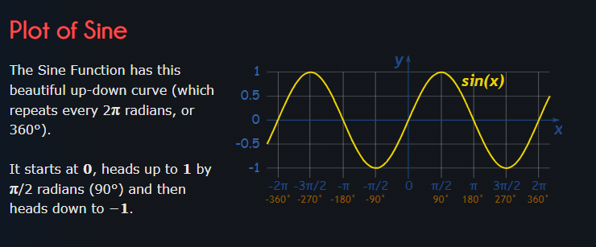
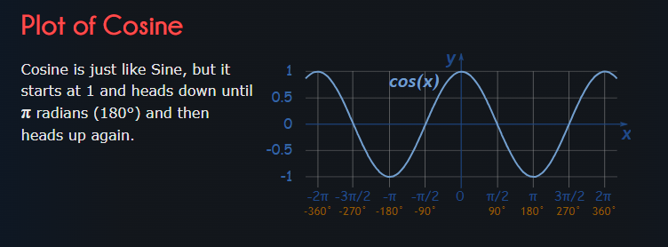
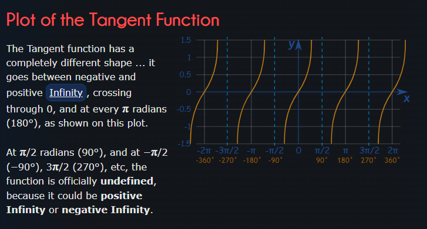
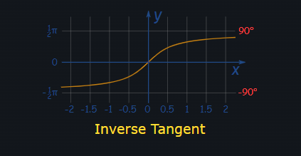
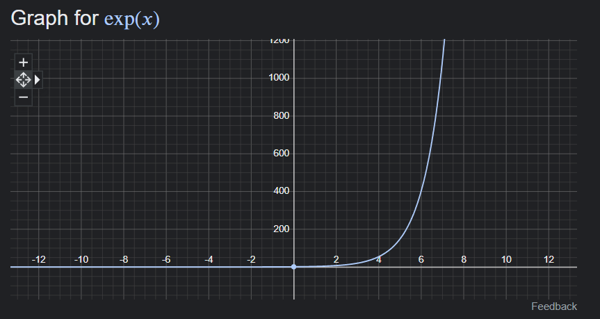
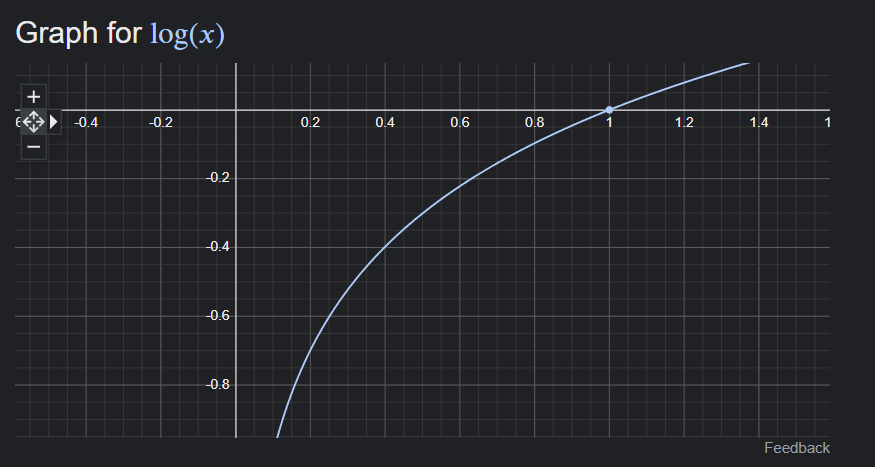
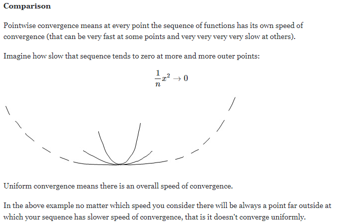
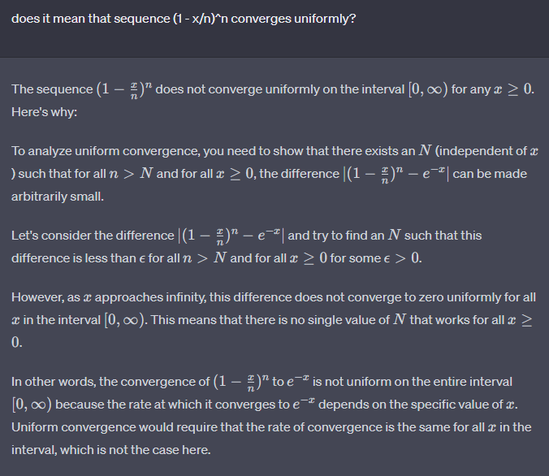

 # LINEAR ALGEBRA
 
 ## What is the geometric interpretation of a vector of $R^p$ and $(n,p)$-matrix as a linear mapping from $R^p$ to $R^n$?

In linear algebra, a vector in R^p represents a point in p-dimensional Euclidean space. Geometrically, we can visualize a vector as an arrow starting at the origin (0,0,..,0) and ending at the point represented by the vector. The length of the arrow represents the magnitude of the vector, and the direction of the arrow represents the direction of the vector.

On the other hand, an (n,p)-matrix represents a linear mapping from R^p to R^n. This means that it maps each vector in R^p to a vector in R^n in a linear way. Geometrically, we can think of this mapping as a transformation of the p-dimensional Euclidean space into the n-dimensional Euclidean space. The matrix specifies how each vector in the original space is transformed into a new vector in the transformed space.

More specifically, let A be an (n,p)-matrix, and let x be a vector in R^p. Then the product Ax gives us a new vector in R^n that is the result of applying the linear mapping specified by A to the vector x. Geometrically, we can think of this as taking the arrow representing x in the p-dimensional space, transforming it according to the linear transformation specified by A, and ending up with a new arrow representing the resulting vector in the n-dimensional space.

For example, if A is a 2x2 matrix and x is a vector in R^2, then Ax gives us a new vector in R^2 that is the result of applying the linear transformation specified by A to the vector x. **Geometrically, we can think of this as transforming the arrow representing x in the plane, according to the linear transformation specified by A, and ending up with a new arrow representing the resulting vector in the plane.**

## Recall the classical operations on matrices: addition, multiplication, inverse and what their interpretations are.
  
Matrix Addition: Given two matrices A and B of the same size (i.e., they have the same number of rows and the same number of columns), their sum A + B is the matrix obtained by adding the corresponding entries of A and B. Geometrically, this operation corresponds to the vector addition of the column vectors of A and B.

Matrix Multiplication: Given two matrices A and B, the product AB is defined only if the number of columns of A is equal to the number of rows of B. The resulting matrix AB is obtained by taking linear combinations of the columns of B with the coefficients given by the entries of the corresponding row of A. Geometrically, this operation corresponds to a composition of linear transformations.

Matrix Inverse: Given a square matrix A, its inverse A^-1 is a matrix such that AA^-1 = A^-1A = I, where I is the identity matrix. In other words, the inverse of a matrix undoes the effect of the matrix on a vector, and it exists only if the matrix is invertible (i.e., its determinant is not zero). Geometrically, the inverse of a matrix corresponds to the inverse transformation that undoes the effect of the original transformation.

These operations are fundamental to matrix algebra, and they have important applications in various fields such as physics, engineering, computer science, and economics.

## Recall what the rank of a matrix is. Apply a change of basis on a matrix and explain what it means.

Rank of a Matrix:
The rank of a matrix A is the maximum number of linearly independent rows (or columns) of A. In other words, it is the dimension of the subspace spanned by the rows (or columns) of A. The rank of a matrix provides information about the dimension of the range of the linear transformation associated with A, and it also has implications for the existence and uniqueness of solutions to systems of linear equations involving A.

Change of Basis on a Matrix:
A change of basis on a matrix refers to the process of expressing the same linear transformation (specified by the matrix) in terms of different bases of the domain and range spaces. More precisely, suppose that A is an n x m matrix that represents a linear transformation T: R^m -> R^n with respect to the standard bases of R^m and R^n. Suppose also that we have a change of basis matrix P that transforms the standard basis of R^m into a new basis B for R^m, and a change of basis matrix Q that transforms the standard basis of R^n into a new basis C for R^n. Then, we can obtain the matrix representation of the same linear transformation T with respect to the bases B and C by computing the product $Q^{-1}AP$.

Let's say you have a matrix A, and you want to express its entries in terms of a new basis. Let the original basis vectors be represented as [v1, v2, ..., vn], and the new basis vectors as [w1, w2, ..., wn]. To perform the change of basis, you need to find the transformation matrix P, where the columns of P are the components of the new basis vectors expressed in terms of the original basis. In other words:

P = [ [v1 in terms of w], [v2 in terms of w], ..., [vn in terms of w] ]

Then, the matrix B obtained by applying the change of basis to matrix A is calculated as follows:

$$B = P^{(-1)} * A * P$$

$v1 = [1,1]$
$v2 = [1, -1]$

$w1 = [2,1]$
$w2 = [1,2]$

$v1 = a * w1 + b * w2$\
$v2 = c * w1 + d * w2$

$v1 = 1/3 * w1 + 1/3 * w2$\
$v2 = 1 * w1 -1 * w2$

$P = [[ 1/3 , 1 ], [ 1/3,  -1]]$

Geometrically, a change of basis on a matrix corresponds to changing the coordinate systems in the domain and range spaces, while keeping the same underlying linear transformation. It allows us to represent the same linear transformation with respect to different bases, which can be useful for various applications, such as diagonalization of matrices, optimization problems, and data analysis.

##  Recall what is an inner product in a Euclidean space

In a Euclidean space, an inner product, also known as dot product, is a bilinear operation that takes two vectors as input and produces a scalar as output. More specifically, an inner product on a real vector space V is a function ⟨·,·⟩: V × V → R that satisfies the following properties for all vectors u, v, and w in V, and all scalars c:

- Symmetry: ⟨u, v⟩ = ⟨v, u⟩

- Linearity in the first argument: ⟨cu + v, w⟩ = c⟨u, w⟩ + ⟨v, w⟩

- Positive definiteness: ⟨u, u⟩ ≥ 0, with equality if and only if u = 0.

$$\langle x,y \rangle = x \cdot y = \sum^p_{i=1} x_i \cdot y_i$$

- Geometric interpretation: The inner product of two vectors x and y is related to the cosine of the angle $\theta$ between them. Specifically, $\langle x, y \rangle = |x| \cdot |y| \cdot cos(\theta)$, where $|v|$ is the magnitude of a vector. If the vectors are orthogonal ($\theta = 90$) the dot product is 0. If vectors point in the same direction, the dot product is positive, if in opposite directons, then it's negative. It is a measure of how much the vectors are aligned or orthogonal to each other. The properties of the inner product also allow us to define concepts such as norm, distance, orthogonality, and angle in a Euclidean space.
- Projection: The dot product can be used to find the projection of one vector onto another. It tells you how much of one vector lies in the direction of another vector. If you want to find the component of x in the direction of y, it's $\langle x, y \rangle / |y|$
- Orthogonality: Two vectors are orthogonal (perpendicular) if and only if their dot product is zero.
- Distance and Norms: The dot product is used to calculate the Euclidean distance between two vectors. It's also essential for defining vector norms (such as the Euclidean norm or L2 norm) and measuring the "size" or length of a vector.

Examples of inner products in Euclidean spaces include the dot product on R^n and the standard inner product on the space of continuous functions with square-integrable norm.

## Recall what is the orthogonal projection onto a linear subspace
 
In linear algebra, the orthogonal projection onto a linear subspace W of a vector space V is a linear transformation P: V → W that maps every vector in V onto its nearest point in W, measured with respect to the Euclidean norm induced by an inner product on V.

- Linear Subspace: A linear subspace is a subset of a vector space that is itself a vector space. It contains the zero vector, is closed under addition and scalar multiplication, and is a flat, linear set that goes through the origin. In Euclidean space, a linear subspace can be thought of as a line, plane, or hyperplane.

More formally, the orthogonal projection P is defined as follows:

For any vector v in V, we decompose it into a sum of two vectors, one in W and the other in W's orthogonal complement W⊥, i.e., v = w + w', where w is in W and w' is in W⊥.
Then, the orthogonal projection of v onto W is defined as the vector Pv that lies entirely in W and is closest to v in the sense of Euclidean distance, i.e., ||v - Pv|| ≤ ||v - w'|| for any w' in W.
The orthogonal projection onto a linear subspace has many important properties and applications in mathematics and its applications. For example:

The projection operator P is idempotent, i.e., P^2 = P, meaning that applying the projection twice gives the same result as applying it once.
The projection operator P is self-adjoint, i.e., ⟨Pv, w⟩ = ⟨v, Pw⟩ for all v, w in V, where ⟨·, ·⟩ denotes the inner product on V.
The projection operator P is the identity on W, meaning that Pv = v for all v in W.
The projection operator P is uniquely determined by its range, which is the subspace W.

You can find orthogonal projection $p$ onto linear subspace $U$ by using dot product. If $B$ is an orthogonal basis of the subspace $U$, then the projection $p$ can be calculated as:

$$p = \sum^n_{i=1}\frac{\langle v, b_i \rangle}{\langle b_i, b_i \rangle} \cdot b_i$$

This formula calculates the projection of $v$ onto the subspace spanned by the basis vectors $b_i$, ensuring that the resulting projection $p$ is orthogonal to $U$.

Example:

Let $W$ be a subspace of $R^n$ with orthogonal basis {$\vec{u_1}, \vec{u_2}, ..., \vec{u_m}$}. Then for any vector $\vec{x}$ in $R^n$, the orthogonal projection of $\vec{x}$ onto $W$ is given by:

$$\vec{x_w} = \frac{\vec{x}\cdot\vec{u_1}}{\vec{u_1}\cdot\vec{u_1}}\cdot\vec{u_1} + \frac{\vec{x}\cdot\vec{u_2}}{\vec{u_2}\cdot\vec{u_2}}\cdot\vec{u_2} + ... + \frac{\vec{x}\cdot\vec{u_m}}{\vec{u_m}\cdot\vec{u_m}}\cdot\vec{u_m}$$

Let $W = Span${$[1,0,-1,0], [0,1,0,-1], [1,1,1,1]$} and $\vec{x}=[0,1,3,4]$. Compute $\vec{x_W}$ and the distance from $\vec{x}$ to $W$.

The distance from $\vec{x}$ to $W$ is magnitude of:
$\vec{x}_{W^\perp}$ = projection of $\vec{x}$ onto the orthogonal complement of $W$ and = $\vec{x} - \vec{x}_W$

Vectors in W Span are orthogonal, because $\vec{u_1}\cdot\vec{u_2}=0, \vec{u_1}\cdot\vec{u_3}=0, \vec{u_2}\cdot\vec{u_3}=0$

After formula calculation, we get:

$\vec{x}_W = \frac{1}{2}\begin{bmatrix}1\\1\\7\\7\end{bmatrix}$

Next, $\vec{x}_{W^\perp}$ equals to:

$\vec{x}_{W^\perp} = \begin{bmatrix}-0.5\\0.5\\-0.5\\0.5\end{bmatrix}$

Thus, distance from $x$ to $W$ is:

$$||\vec{x}_{W^\perp}|| = \sqrt{{-0.5}^2 + {0.5}^2 + {-0.5}^2+ {0.5}^2} = 1 unit$$

##  Give the expression of the projection matrix onto the linear span of linearly independent vectors $v_1, v_2, ..., v_d$ (that are not necessarily orthonormal)

Let V be a linear subspace of a Euclidean space and let $v_1, v_2, ..., v_d$ be a set of linearly independent vectors in V. The orthogonal projection matrix $P$ onto the subspace spanned by $v_1, v_2, ..., v_d$ is given by:

$P = A(A^TA)^{-1}A^T$

where A is the matrix whose columns are the vectors $v_1, v_2, ..., v_d$. In other words,

$P = [v_1 v_2 ... v_d][v_1 v_2 ... v_d]^{-1}$

where $[v_1 v_2 ... v_d]$ is a $d x d$ matrix whose columns are the vectors $v_1, v_2, ..., v_d$, and $[v_1 v_2 ... v_d]^{-1}$ is the inverse of this matrix, which exists since the vectors are linearly independent.

To use this projection matrix to project a vector $x$ onto the subspace $V$, we simply compute the product $Px$, which gives us the orthogonal projection of $x$ onto $V$.

# ANALYSIS

## Classical Math Symbols

- $\sum$ - summation
- $\prod$ - product
- $f\circ g$ - composition of two functions $= (f \circ g)(x) = f(g(x))$. This means that you first apply function "g" to the input "x," and then you apply function "f" to the result of "g(x)." In other words, you substitute the output of "g" into "f" to get the composition of the two functions.

## $sin, cos, tan, arctan, exp, log, x \mapsto x^\alpha, \alpha \in R$

- sin(x) (sine function): The domain of the sine function is all real numbers.

$$\frac{d}{dx} sin(x) = cos(x)$$

$$\int sin(x) dx = -cos(x) + C$$

- cos(x) (cosine function): Similar to the sine function, the domain of the cosine function is all real numbers.

$$\frac{d}{dx} cos(x) = -sin(x)$$

$$\int cos(x) dx = sin(x) + C$$

- tan(x) (tangent function): The domain of the tangent function is all real numbers except for values where the cosine function is zero (i.e., odd multiples of $\pi/2$): $x ∈ ℝ, x ≠ (2n + 1)π/2$, where n is an integer. $tan(x) = \frac{sin(x)}{cos(x)}$

$$\frac{d}{dx} tan(x) = sec^2(x) = \frac{1}{cos^2(x)}$$

$$\int tan(x) dx = -ln(cos(x)) + C$$

- arctan(x) (inverse tangent or arctangent function): The domain of the arctangent function is all real numbers. $arctan(x) = tan^{-1}(x) = \theta$, where , where $-π/2 < \theta < π/2$ in radians, which corresponds to angles in the first and fourth quadrants.

$$\frac{d}{dx} arctan(x) = \frac{1}{1 + x^2}$$

$$\int arctan(x) dx = x * arctan(x) - \frac{1}{2} * ln(1 + x^2) + C$$

- exp(x) (exponential function): The domain of the exponential function is all real numbers.

$$\frac{d}{dx} exp(x) = exp(x)$$

$$\int exp(x) dx = exp(x) + C$$

- log(x) (natural logarithm function): The domain of the natural logarithm function is positive real numbers (x > 0).

$$\frac{d}{dx} log(x) = \frac{1}{x}$$

$$\int log(x) dx = x * (ln(x) - 1) + C$$

- $x \mapsto x^\alpha$ - raise x to power $\alpha$, domain all real numbers.

$$\frac{d}{dx} x^\alpha = \alpha \cdot x^{\alpha-1}$$

$$\int x^\alpha dx = \frac{x^{\alpha + 1}}{\alpha + 1} + C$$

## $\frac{d}{dx} : f \circ g, f \cdot g, \frac{f}{g}$

- Chain Rule: $f \circ g$: If you have a composite function f(g(x)), where f and g are differentiable functions, the derivative is found using the chain rule. The chain rule states that:
$$(f \circ g)'(x) = f'(g(x)) * g'(x)$$

- Product Rule: $f \cdot g$:
$$(f \cdot g)' = f'(x) \cdot g(x) + f(x) \cdot g'(x)$$

- Quotient Rule: $\frac{f(x)}{g(x)}$: 
$$(\frac{f}{g})'(x) = \frac{f'(x) \cdot g(x) - f(x) \cdot g'(x)}{g(x)^2}$$

## Taylor Expansion / Limits

The Taylor expansion (or Taylor series) of a function at a point is a way to represent a function as an infinite sum of terms involving its derivatives. It's a useful tool in calculus for approximating functions, particularly when you want to analyze a function's behavior near a specific point. The Taylor expansion of a function f(x) at a point a is typically written as:

$$f(x) = f(a) + f'(a)(x - a) + \frac{f''(a)(x - a)^2}{2!} + \frac{f'''(a)(x - a)^3}{3!} + ...$$

$$=$$

$$f(x) = \sum^\infty_{n=0}\frac{f^{(n)}(a)}{n!}(x-a)^n$$

, where:
- $f^{(n)}(a)$ - $n_{th}$ derivative of f at point a
- a - real or complex number

This means that as x gets closer and closer to the value a, the function f(x) approaches the limit L.

To find the limit of a function at a point, you can follow these steps:

- Substitute the value a into the function: Replace x with the value a in the function f(x).

- Calculate the result: Evaluate the expression to find the limit L.

The limit L may exist and be a real number, it may be infinity (∞), or it may not exist (undefined). Various techniques and rules, such as L'Hôpital's Rule or algebraic manipulations, can be applied to determine limits in more complex cases. The limit helps you understand the behavior of a function near a particular point.

Find limits for:

1. $lim_{x \rightarrow 0}\frac{sin(x)}{x} = $

Start with the function f(x) = sin(x)/x.

As x approaches 0, you'll notice that both the numerator (sin(x)) and the denominator (x) go to 0. This is an indeterminate form (0/0).

Apply L'Hôpital's Rule, which states that if you have an indeterminate form 0/0, you can find the limit by taking the derivative of the numerator and the derivative of the denominator and then evaluating the limit again.

$f'(x) = (sin(x))' = cos(x)$

$g'(x) = x' = 1$

$\lim_{x \rightarrow 0}\frac{sin(x)}{x} = \lim_{x \rightarrow 0}\frac{cos(x)}{1} = cos(0) = 1$

2. $\lim_{x \rightarrow 0} \frac{1-cos(x)}{x}$

$\frac{d}{dx}(1-cos(x)) = sin(x)$

$\lim_{x \rightarrow 0} \frac{1-cos(x)}{x} = \lim_{x \rightarrow 0} sin(x) = sin(0) = 0$

3. $\lim_{x \rightarrow 0} \frac{1-cos(x)}{x^2}$

Apply L'Hopital's Rule:

$\lim_{x \rightarrow 0} \frac{sin(x)}{2x}$

Apply L'Hopital's Rule:

$\lim_{x \rightarrow 0} \frac{cos(x)}{2} = \frac{1}{2}$

4. $\lim_{x \rightarrow 0} \frac{log(1 + x)}{sin(x)}$

$log(1+x)' = \frac{1}{1+x}$

Apply L'Hopital's Rule:

$\lim_{x \rightarrow 0} \frac{log(1 + x)}{sin(x)} = \lim_{x \rightarrow 0} \frac{\frac{1}{1+x}}{cos(x)} = 1$

## Real-Valued/Monotone/Increasing/Decreasing/Bounded/Converging **Sequences**

- Real-Valued Sequence:

A real-valued sequence is a list or an ordered set of real numbers that are indexed by natural numbers (usually starting from n = 1 or n = 0). It's typically denoted as {u_n}, where "u_n" represents the nth term of the sequence. In mathematical notation:

{$u_n$} = $u_1, u_2, ...$

- Monotone Sequence:

A sequence {u_n} is said to be monotone if it either consistently increases or consistently decreases as n increases. There are two types of monotone sequences:

Increasing Sequence: A sequence is increasing if, for all n, u_(n+1) ≥ u_n. In other words, each term is greater than or equal to the previous term.

Decreasing Sequence: A sequence is decreasing if, for all n, u_(n+1) ≤ u_n. In other words, each term is less than or equal to the previous term.

- Bounded Sequence

A sequence {u_n} is said to be bounded if there exist real numbers M and m (M > m) such that for all n, m ≤ u_n ≤ M. In other words, the values of the sequence are confined within a certain interval.

- Converging Sequence

A sequence {u_n} converges to a limit L if, for every $\epsilon > 0$, there exists an N such that for all $n ≥ N, |u_n - L| < \epsilon$. In simpler terms, a sequence converges if its terms get arbitrarily close to a fixed value L as n becomes larger. If such an L exists, it's called the limit of the sequence, and we write:

$$\lim_{n \rightarrow \infty} u_n = L$$

### Sufficient Conditions for Existence of a Limit

Several conditions and theorems can be used to determine if a limit exists for a given sequence. Some common sufficient conditions include:

- Monotone Convergence Theorem: If a sequence is both bounded and monotone (either increasing or decreasing), then it converges to a limit.

- Cauchy Criterion: A sequence {$u_n$} of real numbers converges if and only if it is a Cauchy sequence, meaning that for every $\epsilon > 0$, there exists an N such that for all $n, m ≥ N, |u_n - u_m| < \epsilon$. In simpler terms, this means that the terms of the sequence get arbitrarily close to each other as you move further along the sequence.

- Bolzano-Weierstrass Theorem: Every bounded sequence has a convergent subsequence. If the original sequence also satisfies some additional properties, it may converge to the same limit as the subsequence. 
    - Boundedness of the Original Sequence: If the original sequence {u_n} is bounded, meaning there exist real numbers M and m (M > m) such that for all n, m ≤ u_n ≤ M, and if the subsequence {u_{n_k}} converges to a limit L, then the original sequence {u_n} also converges to L. In other words, if you have a bounded sequence and a convergent subsequence within it, the entire sequence will converge to the same limit as the subsequence.

## Sequences: Sequence of Functions / Pointwise and Uniform Convergence

1. Sequence of functions: A sequence of functions is a list or a series of functions, typically indexed by a natural number or an integer. Each function in the sequence is associated with a specific index, and as the index increases, the functions in the sequence change. In mathematical notation, a sequence of functions is often represented as $(f_n)$, where n is the index. Formally, a sequence of functions is defined as: $(f_n)_n \in N$, where:
    - $(f_n)$ - represents the sequence of functions, where each $f_n$ is a function.

    The key idea is that as n varies, the functions $f_n$ in the sequence can change in various ways, such as their formulas, behaviors, or properties. The sequence of functions can be finite or infinite. For example, you might encounter a following sequence of functions:
    $$f_1(x) = x, f_2(x) = x^2, f_3(x) = \frac{1}{x}$$

2. Pointwise conversion: When we say that a sequence of functions $(f_n)_{n \ge 1}$ converges pointwise to a function $f$  we mean that for each point x in the domain of the functions, the limit of the sequence of function values $f_n(x)$ as n approaches infinity is equal to the value of the limiting function f at that point.  In other words, for every fixed x,  the sequence $f_n(x)_{n \ge 1}$ converges to $f(x)$. Mathematically, pointwise convergence can be expressed as:

    $\lim_{n \rightarrow \infty} f_n(x) = f(x)$ for all x in the domain.

    Pointwise convergence focuses on the behavior of the functions at individual points in the domain and doesn't necessarily guarantee that the convergence is uniform across the entire domain. 

    Consider the sequence of functions $f_n(x)$ defined on the interval [0, 1] as follows: $f_n(x) = x^n$. Here, for each $n, f_n(x)$ is the function $x^n$.

    - For any fixed x in the interval [0, 1] as n increases $f_n(x)$ converges to 0 if $0 \le x < 1$
    - At $x = 1, f_n(x) = 1^n = 1$ for all n, so it doesn't converge to 0 at $x=1$.

    In this example, the sequence of functions $f_n(x)$ converges pointwise to the function $f(x) = 0$ for $0 \le x < 1$ but not at $x = 1$. At each point x in the interval [0,1] the limit of $f_n(x)$ as n approaches infinity is either 0 or 1, depending on the value of x.

3. Uniform convegence: Uniform convergence is a stronger form of convergence for a sequence of functions. It occurs when, for any given positive real number $\epsilon$, there exists a point in the sequence beyond which all functions in the sequence are within $\epsilon$ distance of the limiting function. In other words, the convergence is uniform if the rate of convergence is the same for all points in the domain. Mathematically, uniform convergence can be expressed as: $\forall \epsilon > 0, \exist N \in N$, such that $|f_n(x) - f(x)| < \epsilon$ for all $n > N$ and all x in the domain.

    The key difference between pointwise and uniform convergence is that in uniform convergence, the choice of N (the point in the sequence beyond which the functions are uniformly close to f) does not depend on the specific point x in the domain. This means that the functions in the sequence get closer to the limiting function at a uniform rate across the entire domain.

    Uniform convergence implies pointwise convergence, but the reverse is not necessarily true. A sequence can converge pointwise without converging uniformly. Uniform convergence is a stronger condition and often leads to more convenient and powerful results in analysis.

    Consider the sequence of functions $g_n(x)$ defined on [0, 1] as follows: $g_n(x)=\frac{x}{n}$. Again, for each n, $g_n(x)$ is the function $\frac{x}{n}$. 
    - For any fixed x in [0, 1] as n increases, $g_n(x)$ converges uniformly to the function $g(x) = 0$. This is because, for any x in the interval, the difference $|g_n(x) - g(x)| = |g_n(x) - 0| = \frac{x}{n}$ can be made arbitrarily small by choosing a sufficiently large n. The rate of convergence is the same for all x in the interval.

In the 2nd example, the sequence of functions $g_n(x)$ converges uniformly to the function $g(x) = 0$ on the interval [0, 1]. The key difference from pointwise convergence is that the choice of n for uniform convergence does not depend on the specific point x in the domain; it is uniform across the entire interval.

Calculate point-wise limits of:

1. $\lim_{n \rightarrow + \infty} x^n, x \ge 0$

The limit depends on the value of x:

- $0 \le x < 1: \lim_{n \rightarrow + \infty} x^n = 0$ 
- $x = 1: \lim_{n \rightarrow + \infty} x^n = \lim_{n \rightarrow + \infty} 1^n = 1$
- $x > 1: \lim_{n \rightarrow + \infty} x^n = + \infty$

2. $\lim_{n \rightarrow + \infty} (1 - \frac{x}{n})^n, x \ge 0$

This limit can be solved using Taylor Expansion theorem (Taylor series), where a = 0, thus called Maclaurin series.

$$f(x) = \sum_{n=0}^\infty\frac{f^{(n)}(0)}{n!}x^n$$

With Maclaurin series we know that:

$e^x = 1 + x + \frac{x^2}{2!} + \frac{x^3}{3!} + ...$

Using binominal theorem, we can expand:

$(1 - x) = 1 - nx + \frac{n(n-1)}{2!}x^2 - \frac{n(n-1)(n-2)}{3!}x^3 + ...$

Put $\frac{x}{n}$ instead of $x$:

$(1 - \frac{x}{n}) = 1 - x + \frac{n(n-1)}{2!}\frac{x^2}{n^2} - \frac{n(n-1)(n-2)}{3!}\frac{x^3}{n^3} + ... = 1 - x + \frac{n^2(1-1/n)}{2!}\frac{x^2}{n^2} - \frac{n^3(1-1/n)(1-2/n)}{3!}\frac{x^3}{n^3} + ... = 1 - x + \frac{(1-1/n)}{2!}x^2 - \frac{(1-1/n)(1-2/n)}{3!}x^3 + ...$

Now calculate limit:

$\lim_{n \rightarrow + \infty} (1 - \frac{x}{n})^n = 1 - x + \frac{(1-1/n)}{2!}x^2 - \frac{(1-1/n)(1-2/n)}{3!}x^3 + ... = 1 - x + \frac{x^2}{2!} - \frac{x^3}{3!} + ... = e^{-x}$

The pointwise limit depends on the value of x.

- What is the geometric interpretation of a vector of $R^p$ and $(n,p)$-matrix as a linear mapping from $R^p$ to $R^n$?

In linear algebra, a vector in R^p represents a point in p-dimensional Euclidean space. Geometrically, we can visualize a vector as an arrow starting at the origin (0,0,..,0) and ending at the point represented by the vector. The length of the arrow represents the magnitude of the vector, and the direction of the arrow represents the direction of the vector.

On the other hand, an (n,p)-matrix represents a linear mapping from R^p to R^n. This means that it maps each vector in R^p to a vector in R^n in a linear way. Geometrically, we can think of this mapping as a transformation of the p-dimensional Euclidean space into the n-dimensional Euclidean space. The matrix specifies how each vector in the original space is transformed into a new vector in the transformed space.

More specifically, let A be an (n,p)-matrix, and let x be a vector in R^p. Then the product Ax gives us a new vector in R^n that is the result of applying the linear mapping specified by A to the vector x. Geometrically, we can think of this as taking the arrow representing x in the p-dimensional space, transforming it according to the linear transformation specified by A, and ending up with a new arrow representing the resulting vector in the n-dimensional space.

For example, if A is a 2x2 matrix and x is a vector in R^2, then Ax gives us a new vector in R^2 that is the result of applying the linear transformation specified by A to the vector x. **Geometrically, we can think of this as transforming the arrow representing x in the plane, according to the linear transformation specified by A, and ending up with a new arrow representing the resulting vector in the plane.**

- Recall the classical operations on matrices: addition, multiplication, inverse and what their interpretations are.
  
Matrix Addition: Given two matrices A and B of the same size (i.e., they have the same number of rows and the same number of columns), their sum A + B is the matrix obtained by adding the corresponding entries of A and B. Geometrically, this operation corresponds to the vector addition of the column vectors of A and B.

Matrix Multiplication: Given two matrices A and B, the product AB is defined only if the number of columns of A is equal to the number of rows of B. The resulting matrix AB is obtained by taking linear combinations of the columns of B with the coefficients given by the entries of the corresponding row of A. Geometrically, this operation corresponds to a composition of linear transformations.

Matrix Inverse: Given a square matrix A, its inverse A^-1 is a matrix such that AA^-1 = A^-1A = I, where I is the identity matrix. In other words, the inverse of a matrix undoes the effect of the matrix on a vector, and it exists only if the matrix is invertible (i.e., its determinant is not zero). Geometrically, the inverse of a matrix corresponds to the inverse transformation that undoes the effect of the original transformation.

These operations are fundamental to matrix algebra, and they have important applications in various fields such as physics, engineering, computer science, and economics.

- Recall what the rank of a matrix is. Apply a change of basis on a matrix and explain what it means.

Rank of a Matrix:
The rank of a matrix A is the maximum number of linearly independent rows (or columns) of A. In other words, it is the dimension of the subspace spanned by the rows (or columns) of A. The rank of a matrix provides information about the dimension of the range of the linear transformation associated with A, and it also has implications for the existence and uniqueness of solutions to systems of linear equations involving A.

Change of Basis on a Matrix:
A change of basis on a matrix refers to the process of expressing the same linear transformation (specified by the matrix) in terms of different bases of the domain and range spaces. More precisely, suppose that A is an n x m matrix that represents a linear transformation T: R^m -> R^n with respect to the standard bases of R^m and R^n. Suppose also that we have a change of basis matrix P that transforms the standard basis of R^m into a new basis B for R^m, and a change of basis matrix Q that transforms the standard basis of R^n into a new basis C for R^n. Then, we can obtain the matrix representation of the same linear transformation T with respect to the bases B and C by computing the product Q^(-1)AP.

Geometrically, a change of basis on a matrix corresponds to changing the coordinate systems in the domain and range spaces, while keeping the same underlying linear transformation. It allows us to represent the same linear transformation with respect to different bases, which can be useful for various applications, such as diagonalization of matrices, optimization problems, and data analysis.

##  Recall what is an inner product in a Euclidean space

In a Euclidean space, an inner product is a bilinear operation that takes two vectors as input and produces a scalar as output. More specifically, an inner product on a real vector space V is a function ⟨·,·⟩: V × V → R that satisfies the following properties for all vectors u, v, and w in V, and all scalars c:

Symmetry: ⟨u, v⟩ = ⟨v, u⟩

Linearity in the first argument: ⟨cu + v, w⟩ = c⟨u, w⟩ + ⟨v, w⟩

Positive definiteness: ⟨u, u⟩ ≥ 0, with equality if and only if u = 0.

Geometrically, the inner product of two vectors u and v represents the cosine of the angle between them, scaled by their magnitudes. It is a measure of how much the vectors are aligned or orthogonal to each other. The properties of the inner product also allow us to define concepts such as norm, distance, orthogonality, and angle in a Euclidean space.

Examples of inner products in Euclidean spaces include the dot product on R^n and the standard inner product on the space of continuous functions with square-integrable norm.

Inner products have many applications in mathematics and its applications, including geometry, physics, optimization, signal processing, and machine learning.

## Recall what is the orthogonal projection onto a linear subspace
 
In linear algebra, the orthogonal projection onto a linear subspace W of a vector space V is a linear transformation P: V → W that maps every vector in V onto its nearest point in W, measured with respect to the Euclidean norm induced by an inner product on V.

More formally, the orthogonal projection P is defined as follows:

For any vector v in V, we decompose it into a sum of two vectors, one in W and the other in W's orthogonal complement W⊥, i.e., v = w + w', where w is in W and w' is in W⊥.
Then, the orthogonal projection of v onto W is defined as the vector Pv that lies entirely in W and is closest to v in the sense of Euclidean distance, i.e., ||v - Pv|| ≤ ||v - w'|| for any w' in W.
The orthogonal projection onto a linear subspace has many important properties and applications in mathematics and its applications. For example:

The projection operator P is idempotent, i.e., P^2 = P, meaning that applying the projection twice gives the same result as applying it once.
The projection operator P is self-adjoint, i.e., ⟨Pv, w⟩ = ⟨v, Pw⟩ for all v, w in V, where ⟨·, ·⟩ denotes the inner product on V.
The projection operator P is the identity on W, meaning that Pv = v for all v in W.
The projection operator P is uniquely determined by its range, which is the subspace W.
The orthogonal projection is used in various areas such as image processing, machine learning, physics, and engineering to extract important features and reduce noise.

##  Give the expression of the projection matrix onto the linear span of linearly independent vectors $v_1, v_2, ..., v_d$ (that are not necessarily orthonormal)

Let V be a linear subspace of a Euclidean space and let $v_1, v_2, ..., v_d$ be a set of linearly independent vectors in V. The orthogonal projection matrix $P$ onto the subspace spanned by $v_1, v_2, ..., v_d$ is given by:

$P = A(A^TA)^{-1}A^T$

where A is the matrix whose columns are the vectors $v_1, v_2, ..., v_d$. In other words,

$P = [v_1 v_2 ... v_d][v_1 v_2 ... v_d]^{-1}$

where $[v_1 v_2 ... v_d]$ is a $d x d$ matrix whose columns are the vectors $v_1, v_2, ..., v_d$, and $[v_1 v_2 ... v_d]^{-1}$ is the inverse of this matrix, which exists since the vectors are linearly independent.

To use this projection matrix to project a vector $x$ onto the subspace $V$, we simply compute the product $Px$, which gives us the orthogonal projection of $x$ onto $V$.

## Do you know that symmetric matrices can be diagonalized? Would you be able to compute their eigenvalues and their eigenvectors?

Symmetric matrix is symmetric along its diagonal, meaning $A^T = A$. Properties:
- real eigenvalues;
- eigenvectors corresponding to the eigenvalues  that are orthogonal;
- must be diagonazible.

A matrix that is diagonalizable means there exists a diagonal matrix $D$ whose diagonal entries are the eigenvalues of A (all the entries outside of the diagonal are zeros), such that $P^{-1}AP = D$, where $P$ is an invertible real orthogonal matrix. We can also say that a matrix is diagonalizable if the matrix can be written in the form $A = PDP^{-1}$.

## Eigenvalues and eigenvectors

The eigenvectors of matrix A are the vectors whose directions don’t change after A is applied to it. The direction is not changed, but the vectors can be scaled. This shows the non-triviality of this property. Real eigenvalues indicate stretching or scaling in the linear transformation, unlike complex eigenvalues, which don’t have a “size.”
The set of all the eigenvalues of a matrix is called a spectrum.
